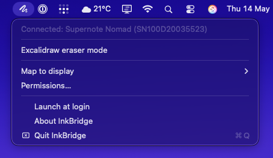

# InkBridge

Unofficial macOS support for the Supernote InkFlow feature. Drives the Mac cursor with pressure and tilt from a Supernote stylus over USB, without needing the Supernote Partner app running.

Note: I am *not* a Swift programmer, this was done with AI help, but it does work! Don't judge the code _too_ harshly :) 



## Use

1. Build and launch `InkBridge.app`
2. Grant Accessibility and Input Monitoring when prompted
3. Plug in the Supernote, open InkFlow on the device

## Build

```
xcodegen generate
open InkBridge.xcodeproj
```

Requires Xcode 15+ and macOS 13+. Ad-hoc signed by default.

## Not affiliated with Ratta / Supernote.
